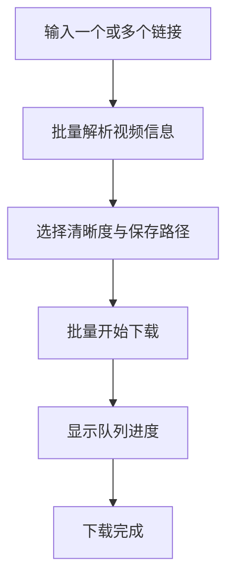
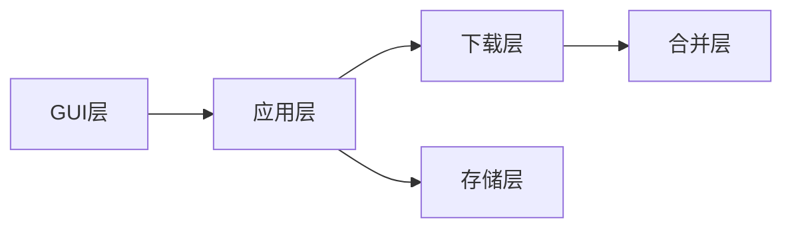

# B站视频下载工具桌面GUI方案

## 1. 目标与范围

### 1.1 首期目标
- 提供桌面GUI应用，支持粘贴B站视频链接后发起下载。
- 界面简洁，聚焦核心路径：输入链接 -> 解析视频信息 -> 选择清晰度 -> 下载保存。
- 具备基本可用的下载任务展示：状态、进度、完成提示。

### 1.2 首期范围边界
- 支持单个普通视频链接下载。
- 支持批量链接下载（多行粘贴或逐条添加）。
- 支持批量任务并发数可配置。
- 支持常见清晰度选择与音视频合并。
- 支持自定义保存目录。

### 1.3 暂不纳入首期
- 合集下载、直播回放下载。
- 账户登录与会员专属清晰度处理。
- 下载队列高级调度与限速规则。

---

## 2. 方案选型

## 2.1 技术栈建议
- 桌面框架：Python + PySide6
- 界面架构：Qt Widgets（单窗口 + 任务列表）
- 下载核心：`yt-dlp` + `ffmpeg`（通过Python子进程调用）
- 线程模型：`QThreadPool + QRunnable`（避免UI阻塞）
- 配置存储：本地JSON配置文件

### 2.2 选型理由
- PySide6 UI现代、跨平台，并且与现有Python环境兼容。
- Python在调用`yt-dlp`/`ffmpeg`与处理日志输出方面实现成本低。
- `yt-dlp` 对B站链接解析能力成熟，维护成本低。
- `ffmpeg` 可稳定完成音视频合并，跨平台能力好。

---

## 3. 功能设计

## 3.1 用户流程
1. 用户粘贴一个或多个B站链接。
2. 点击解析，展示每条任务的视频标题、封面、可下载清晰度。
3. 用户统一或逐任务选择清晰度与保存路径。
4. 点击下载，任务列表展示队列状态与进度。
5. 下载完成后展示完成状态，可打开目录。

## 3.2 界面信息架构
- 顶部：链接输入框 + 解析按钮。
- 中部：视频信息卡片（标题、时长、封面、分P标记）。
- 右侧或下方：清晰度下拉框、保存路径选择。
- 底部：下载按钮、任务进度条、日志简讯。

## 3.3 核心功能清单
- 链接校验与错误提示。
- 视频信息解析。
- 批量任务导入与任务列表管理。
- 并发下载数配置（全局设置）。
- 清晰度选项读取。
- 下载任务启动、进度回传、完成回调。
- 下载失败重试。
- 打开下载目录。

---

## 4. 模块设计

## 4.1 模块划分
- GUI层：输入、展示、交互。
- 应用层：参数校验、任务编排、状态管理。
- 下载层：Python子进程调用 `yt-dlp`，采集标准输出并解析进度。
- 合并层：调用 `ffmpeg` 处理音视频流。
- 存储层：保存下载目录、最近链接、默认清晰度。

## 4.2 关键数据结构草案
- DownloadTask
  - id
  - batchId
  - url
  - title
  - quality
  - savePath
  - queueIndex
  - status
  - progress
  - errorMessage

- DownloadSchedulerConfig
  - maxConcurrency
  - retryCount

---

## 5. 兼容性与约束

## 5.1 运行环境
- 首期优先Windows 10/11。
- 需要可用的 `ffmpeg` 二进制。

## 5.2 合规与风险提示
- 仅下载用户有权访问与使用的内容。
- 需在界面和文档中加入免责声明，提示遵守平台条款与当地法律法规。

## 5.3 主要风险
- 平台策略变更导致解析失败。
- 会员内容与地区限制导致清晰度受限。
- 外部依赖版本变化导致行为差异。

---

## 6. 分阶段实施计划

## 阶段A 基础可用版本
- 创建Python + PySide6项目骨架。
- 完成单链接与批量链接输入解析。
- 完成清晰度选择与本地路径选择。
- 完成批量下载执行与基础队列进度展示。

## 阶段B 可用性增强
- 增加错误处理与重试。
- 增加任务历史记录。
- 增加设置页（默认路径、默认清晰度、并发数）。

## 阶段C 稳定性与发布
- 打包发布Windows安装包。
- 完成关键路径回归测试。
- 输出用户使用说明与常见问题。

---

## 7. 验收标准

- 输入一个或多个有效B站视频链接后可解析出标题与可选清晰度。
- 批量任务可按队列执行并下载到指定目录。
- 并发数配置生效，任务可按设定并发度稳定执行。
- 下载过程有可感知进度与状态提示。
- 下载完成后可在界面打开目标目录。
- 非法链接或解析失败时有明确错误提示。

---

## 8. 实施清单给开发模式

1. 初始化项目骨架与目录结构。
2. 集成 `yt-dlp` 与 `ffmpeg` 调用链路。
3. 实现线程通信与下载任务状态回传（Signal/Slot）。
4. 完成GUI页面与交互。
5. 增加配置持久化与错误处理。
6. 打包发布并补充使用文档。

